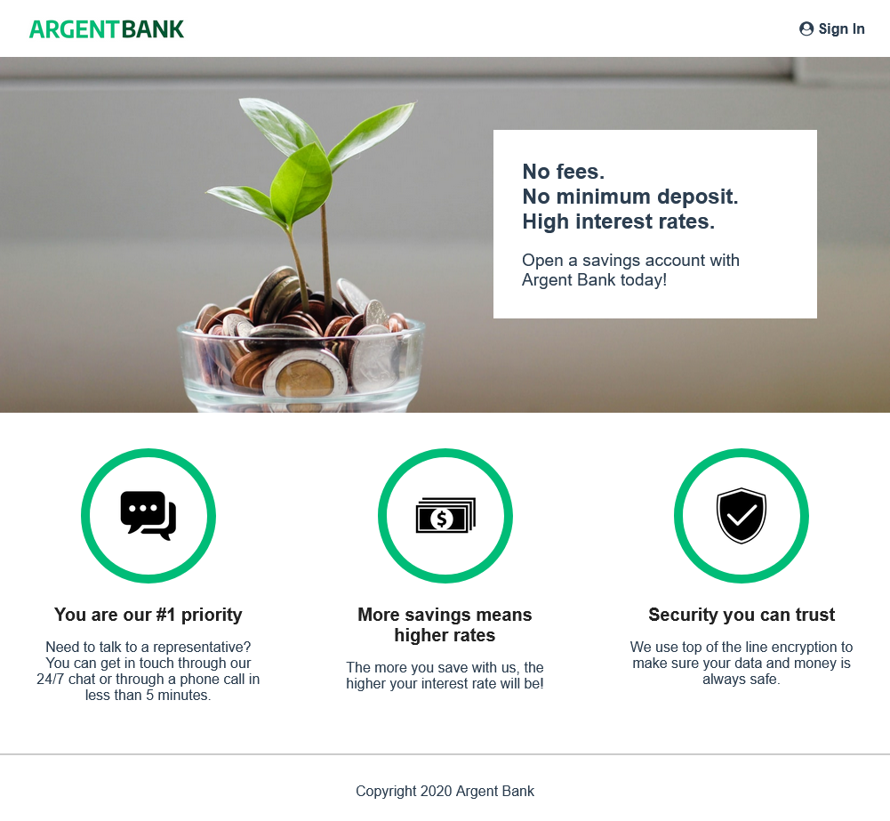
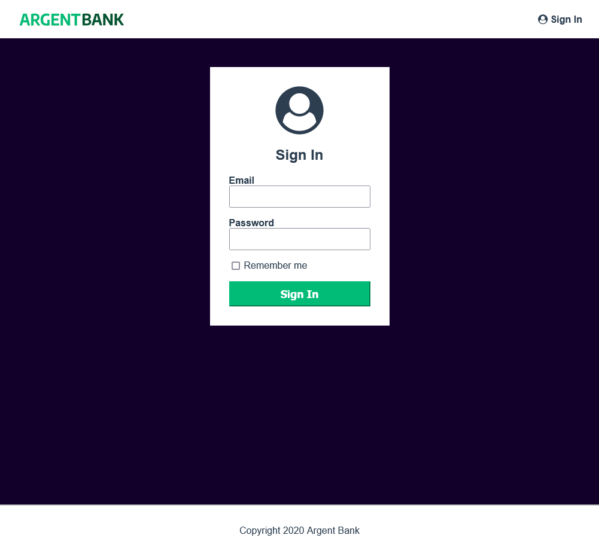
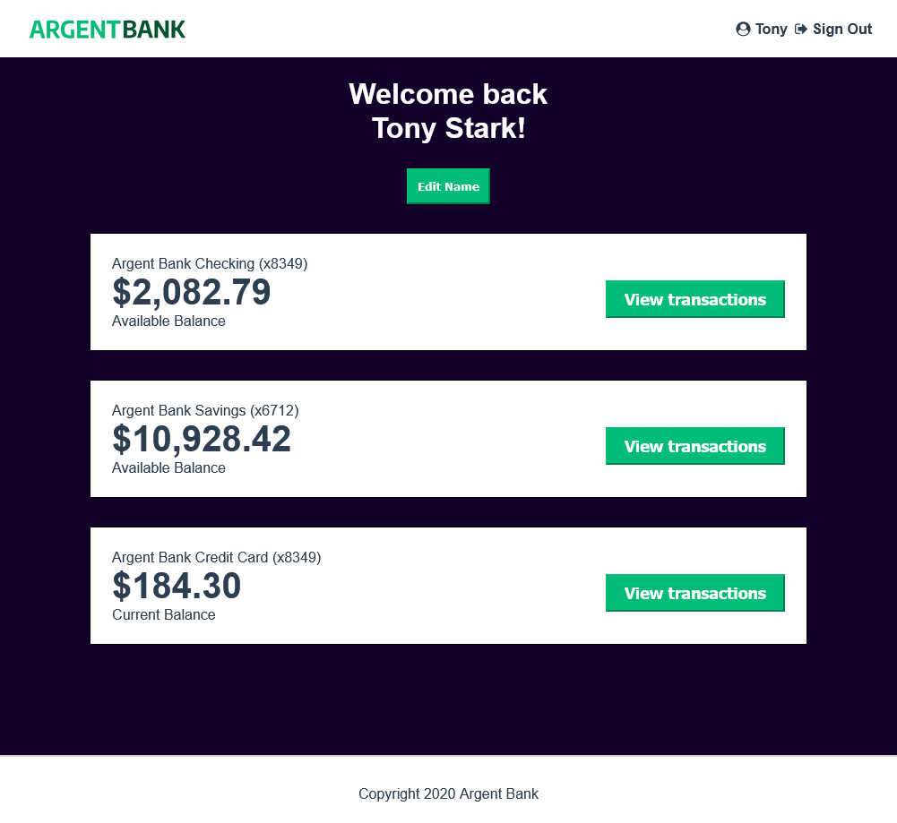
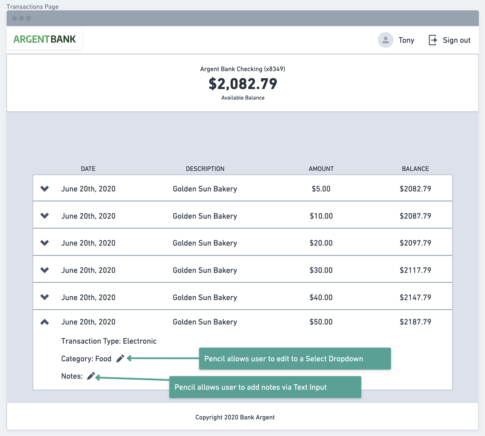
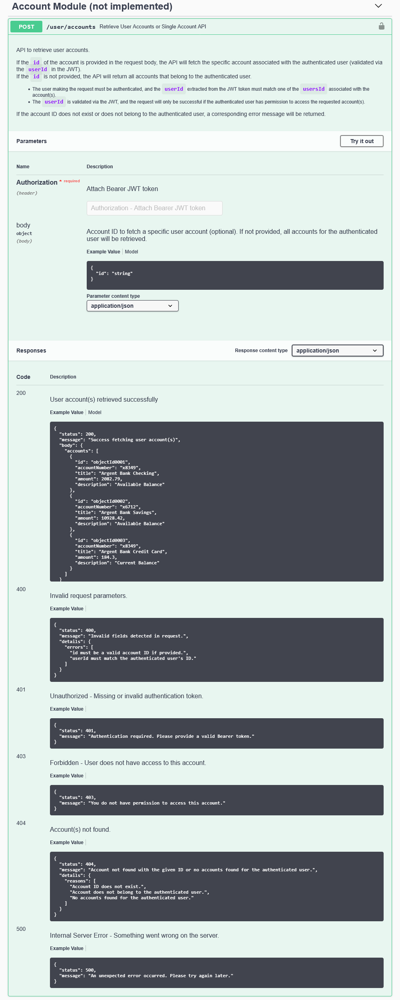
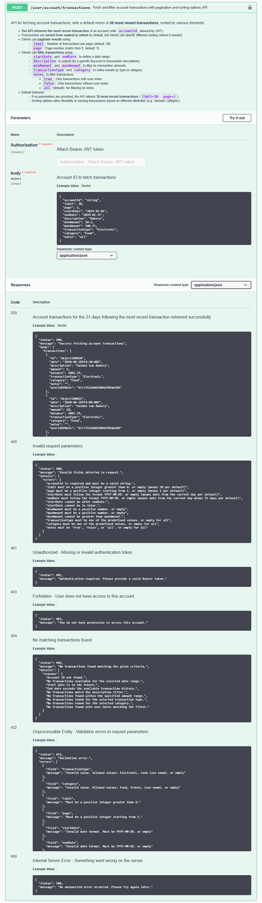
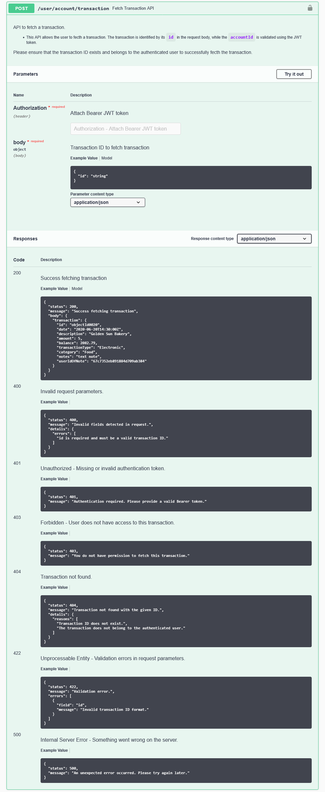
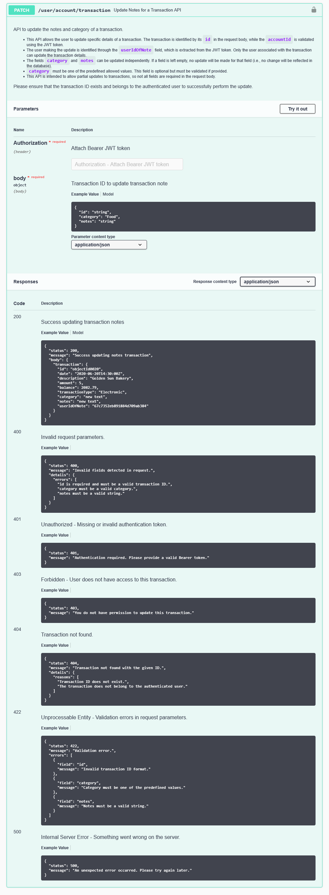
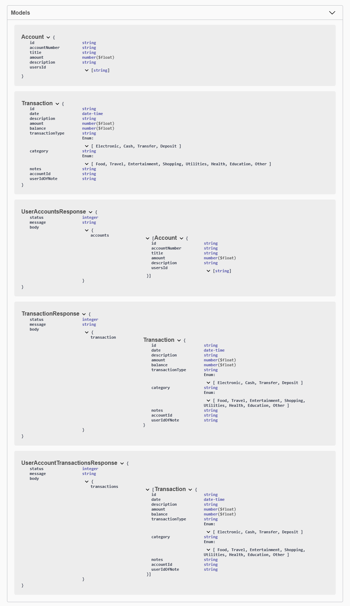

# ARGENTBANK


Création d'une application permettant aux clients de se connecter et de gérer leurs comptes et leur profil.  
\+ proposition EndPoints pour la phase 2 de l'API [ICI](#phase-2--transactions)

  
> [!NOTE]  
> Il s'agit seulement de la mise en place de l'authentification des utilisateurs

#  React +  Vite

Ce projet est une application React configurée avec Vite.

## Prérequis

Avant de commencer, vous devez avoir installé les éléments suivants sur votre machine :

- **Node.js**
- **npm**

## Installation

Suivez les étapes ci-dessous pour configurer ce projet localement :

1. Clonez le dépôt du projet :
   ```bash
   git clone https://github.com/PierreTDX/P13_ArgentBank_FRONT_OC.git

2. Allez dans le dossier du projet :
   ```bash
   cd nom-du-dossier

3. Installez les dépendances du projet :
   ```bash
   npm install

4. Configurer le fichier 'src/api/apiService.js' : 
  
   Pour le développement :
   ```apiService.js
   API_BASE_URL = "http://localhost:3001/api/v1"
   ```
   => Installez l'API en local : [https://github.com/PierreTDX/P13_ArgentBank_BACK_OC.git](https://github.com/PierreTDX/P13_ArgentBank_BACK_OC.git)

   Pour la mise en production :
   ```apiService.js
   API_BASE_URL = "https://p13-argentbank-back-oc.vercel.app/api/v1"
   ```
   => ou utilisez l'API en ligne (si disponible) : [https://p13-argentbank-back-oc.vercel.app/](https://p13-argentbank-back-oc.vercel.app/)

## Lancer l'application

Pour démarrer l'application en mode développement, exécutez la commande suivante :
   ```bash
   npm run dev
   ```

## Build pour la production

Pour créer une version optimisée de l'application pour la production, exécutez :
   ```bash
   npm run build
   ```
   Cette commande génère un dossier dist/ contenant tous les fichiers nécessaires pour déployer l'application.

## Déploiement

Ce projet est prêt à être déployé sur Vercel  
Pour déployer le projet sur Vercel, suivez ces étapes :

- Poussez votre code vers GitHub ou GitLab.
- Connectez votre dépôt à Vercel.
- Vercel détectera automatiquement qu'il s'agit d'une application React et lancera le processus de déploiement.  

L'application est dépoyée ici : [https://p13-argentbank-oc.vercel.app/](https://p13-argentbank-oc.vercel.app/)

## Technologies utilisées

- **React**          - Framework JavaScript pour la création d'interfaces utilisateur.
- **Vite**           - Outil de build rapide pour les applications React.
- **Redux**          - Gestion centralisée et prévisible de l’état de l’application.
- **SASS**           - Préprocesseur CSS pour une meilleure gestion des styles.

## Aperçu de l'application







# Phase 2 : Transactions

Nous sommes encore en phase de conception.  
Puisque vous gérez déjà l'application web pour la phase 1, nous voulons connaître votre avis sur la façon dont vous pensez que les API devraient être modélisées du côté back end. Nous avons besoin que vous nous fournissiez un document décrivant les API proposées pour les transactions, en suivant les directives de Swagger.

## Maquette



## Propositions

1. Les routes









2. Models



3. Lien vers le fichier Swagger

    [./public/swagger.yaml](./public/swagger.yaml)